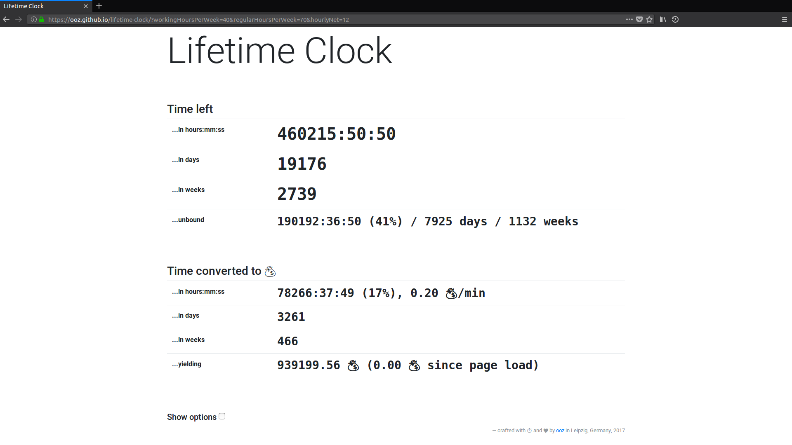

# [Lifetime Clock](https://ooz.github.io/lifetime-clock/)

Customizable lifetime clock. [Try it yourself!](https://ooz.github.io/lifetime-clock/)

[Example configuration](https://ooz.github.io/lifetime-clock/?workingHoursPerWeek=40&regularHoursPerWeek=70&hourlyNet=12) (for more options, check "Show options" on the site)

## License

See [LICENSE](LICENSE) (MIT) file for details.

The files:

* angus96.gif
* angus128.gif

are derivative works based on [https://giphy.com/gifs/acdc-angus-young-TIQKh7HNFvTmo](https://giphy.com/gifs/acdc-angus-young-TIQKh7HNFvTmo) and ARE NOT subject to this license.
